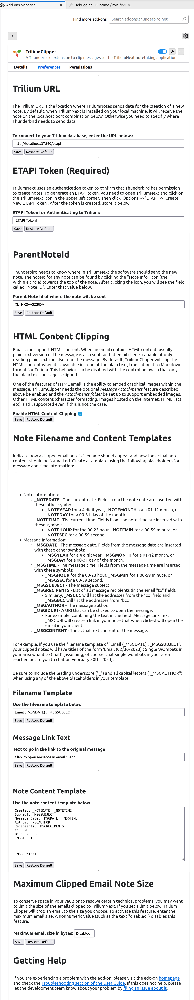

This project is a fork of [ThunderbirdObsidianClipper](https://github.com/KNHaw/ThunderbirdObsidianClipper). The code is experimental at this point in time and is being developed. As is, the extension will send e-mail to TriliumNext. 

The references in this project need to be updated to point to ThunderbirdTriliumClipper.

# ThunderbirdTriliumClipper
TriliumClipper is an add-on for the Thunderbird email client that lets a user clip messages to the TriliumNext notetaking application. Both applications are open source and free to use, just like this add-on!

In addition to the information below, there is a [User Guide](./docs/user-guide.md) giving detailed information on how to use the add-on.

## Installation
You will first need to have the TriliumNext notetaking app on your local platform as well as the Thunderbird email client.
  - You can download Thunderbird for free [here](https://www.thunderbird.net/en-US/download/).
  - You can download TriliumNext for free [here](https://github.com/TriliumNext/Notes/releases).

Currently working to get *Trilium Clipper* added into the Thunderbird Add-on Manager. Until then, you can install Trilium Clipper by downloading the installation file from the [TriliumClipper Add-on Site](https://github.com/0xbismarck/ThunderbirdTriliumClipper/releases/), downloading the XPI file, and install that file from the add-on manager (*Add-on Manager->Settings->Install Add-on From File*).
  <!--- You can install the *Trilium Clipper* add-on into Thunderbird in two ways:
    <!-- - By searching for "ObsdianClipper" in the Add-on mMnager (*Settings->Add-ons Manager*).
    - Or by downloading a file from the [Thunderbird Add-on Site](https://addons.thunderbird.net/en-US/thunderbird/addon/obsidianclipper/), clicking the "Download Now" button to get an XPI file, and installing that file from the add-on manager (*Add-on Manager->Settings->Install Add-on From File*). -->
To test the development version of Trilium Clipper downlaod the source code from the [TriliumClipper Site](https://github.com/0xbismarck/ThunderbirdTriliumClipper) and follow then follow the instructions [here](https://developer.thunderbird.net/add-ons/hello-world-add-on#installing).

After installing TriliumClipper to your Thunderbird client, select the Options tab (*Settings->Add-ons Manager->Trilium Clipper->Options tab*) and configure the add-on to work with TriliumNext on your machine.
<!--  
@todo - add this back in later-->

After you've installed and configured the add-on, you're ready to clip emails!

## Usage
To use TriliumClipper, just select an email and either right click it to find an "TriliumNext" icon in the menu or open the email and look for the "TriliumNext" icon on the header (where you will also find the Reply and Forward buttons). Press the "TriliumNext" button and the message will be sent to your TriliumNext application. (Note, TriliumNext needs to be open before you send an e-mail)

Once your email has been clipped, it will look like the screenshot below. By default, your note will be placed under the note with the ParentNoteId that was configured in the Options.

If you only wish to clip a portion of an email's text, select the text before pressing the TriliumNext icon.

## Getting More Help
If TriliumClipper is not properly working, please take a moment to reread the instructions and reinstall the add-on. If the problem is still happening, please check out the 
[Troubleshooting section of the User Guide](./docs/user-guide.md#Troubleshooting).

## Limitations & Future Features
At this time, TriliumClipper will only clip the text portion of an email and not HTML content (i.e. embedded images, bold or italics, etc). If you're a user who is interested in this or other features, please let me know via the *Feedback* instructions below. Otherwise I will assume there is no demand for them.

## Questions? Feedback?
TriliumClipper is still a work in progress. If you have any questions or want to give me feedback, please reach out to to the team
by [filing an issue on GitHub](https://github.com/0xbismarck/ThunderbirdTriliumClipper/issues).

If sending screenshots for a bug report or via email, make sure to blur or mark out any sensitive information since the images may be accessible to the wider internet.

I hope this add-on proves useful to you.
