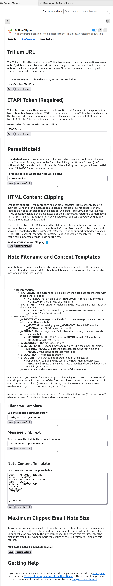
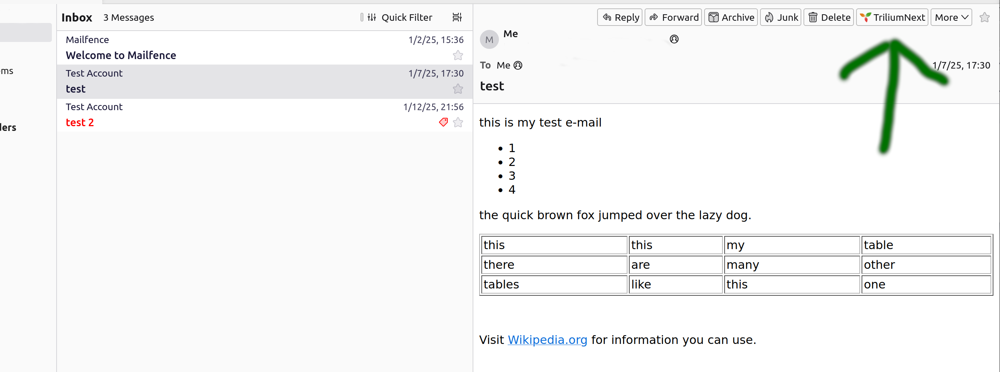
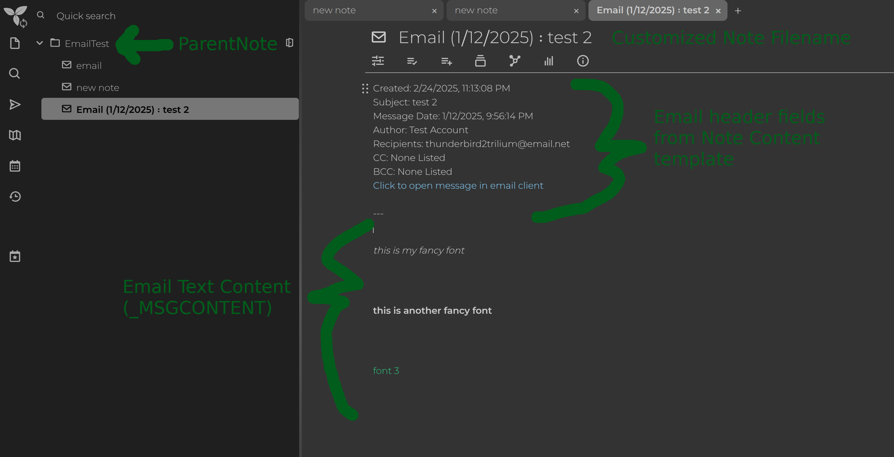

This project is a fork of [ThunderbirdObsidianClipper](https://github.com/KNHaw/ThunderbirdObsidianClipper). The code is experimental at this point in time and is being developed. As is, the extension will send e-mail to Trilium Notes. 

The references in this project need to be updated to point to ThunderbirdTriliumClipper.

# ThunderbirdTriliumClipper
TriliumClipper is an add-on for the Thunderbird email client that lets a user clip messages to the Trilium Notes application. Both applications are open source and free to use, just like this add-on!

In addition to the information below, there is a [User Guide](./docs/user-guide.md) giving detailed information on how to use the add-on.

## Installation
You will first need to have the Trilium Notes app on your local platform as well as the Thunderbird email client.
  - You can download Thunderbird for free [here](https://www.thunderbird.net/en-US/download/).
  - You can download Trilium Notes for free [here](https://github.com/TriliumNext/Trilium/releases).

You can install the *Trilium Clipper* add-on into Thunderbird in two ways:
 - By searching for "TriliumClipper" in the Add-on Manager (*Settings->Add-ons Manager*).
 - Or by downloading the installation file from the [TriliumClipper Add-on Site](https://addons.thunderbird.net/en-US/thunderbird/addon/triliumclipper/), downloading the XPI file, and install that file from the add-on manager (*Add-on Manager->Settings->Install Add-on From File*).

To test the development version of Trilium Clipper download the source code from the [TriliumClipper Site](https://github.com/0xbismarck/ThunderbirdTriliumClipper) and follow then follow the instructions [here](https://developer.thunderbird.net/add-ons/hello-world-add-on#installing).

After installing TriliumClipper to your Thunderbird client, select the Options tab (*Settings->Add-ons Manager->Trilium Clipper->Options tab*) and configure the add-on to work with Trilium Notes on your machine.
 

After you've installed and configured the add-on, you're ready to clip emails!

### Building Source
If you want to build the source code from the repository, there is a build.sh script that will create the xpi file for you to install.

## Usage
To use TriliumClipper, just select an email and either right click it to find an "Trilium" icon in the menu or open the email and look for the "Trilium" icon on the header (where you will also find the Reply and Forward buttons). Press the "Trilium" button and the message will be sent to your Trilium Notes application. (Note, Trilium Notes needs to be open before you send an e-mail)

A message can be clipped in any of the formats below. Which one is used, and whether you are asked to pick one each time, is set by the *Default Clip Format* option. When that option is set to *Ask every time*, pressing the "Trilium" button opens a menu holding these choices:

- *Plain Text* - Clips the plain text version of the message. Formatting, images, and links are dropped, but the text is preserved exactly as it was laid out in the email.
- *HTML* - Clips the formatted HTML version of the message, keeping its styling and links. This is the format used by previous versions of the add-on.
- *Plain Text and HTML* - Clips both versions into a single note, one after the other, separated by a horizontal rule.
- *PDF* - This version of TriliumClipper has the feature removed because the API is experimental. If you would like to have this feature, you'll need to download the add-on from the [releases page](https://github.com/0xbismarck/ThunderbirdTriliumClipper/releases).

If a message does not contain the version you asked for (for example, a plain text only email clipped as HTML), the add-on falls back to the version the message does contain.

If the *Default Clip Format* is set to one of the formats instead of *Ask every time*, no menu appears. Pressing the "Trilium" button clips the message straight away in that format.

Clipping a message by right clicking it in the message list never shows this menu. Those clips use the *Default Clip Format* set on the Options tab, and use HTML when that option is set to *Ask every time*.

See the [Add-on Options section of the User Guide](./docs/user-guide.md#Add-on-Options) for the full list of options, including *Default Clip Format*.

> **Upgrading from an earlier version:** the *Enable HTML Content Clipping* checkbox has been removed, since *Default Clip Format* covers everything it did. Its setting is not carried over. If you had unticked it to clip plain text, set *Default Clip Format* to *Plain Text* on the Options tab to get that behavior back. Otherwise there is nothing to do.

Once your email has been clipped, it will look like the screenshot below. By default, your note will be placed under the note with the ParentNoteId that was configured in the Options.

If you only wish to clip a portion of an email's text, select the text before pressing the Trilium Notes icon. A selection is clipped as plain text.

### Saving Email Attachments
TriliumClipper can also save the files attached to an email into Trilium Notes alongside the clipped message. This is off by default. To turn it on, tick "Enable saving of email attachments" on the add-on's Options tab and save the setting. The files are sent straight to Trilium Notes, so there is nothing to configure in Thunderbird and no folder to choose.

The *Attachment Storage* option chooses how Trilium Notes holds the saved files:
 - *Attachments of the note* - the files become attachments of the clipped email's note, reached through that note's "Attachments" tab.
 - *Child notes of the note* - each file becomes a note of its own beneath the clipped email's note, so the files appear in the note tree and can be moved, cloned, and linked to like any other note.

Images are stored so that Trilium Notes displays them, and all other files are stored so that Trilium Notes offers them for download. The names of the saved files can be listed in the note itself with the *_MSGATTACHMENTLIST* placeholder. See the [Add-on Options](./docs/user-guide.md#Add-on-Options) section of the User Guide for the full details.

## Getting More Help
If TriliumClipper is not properly working, please take a moment to reread the instructions and reinstall the add-on. If the problem is still happening, please check out the 
[Troubleshooting section of the User Guide](./docs/user-guide.md#Troubleshooting).

## Limitations & Future Features
TriliumClipper can clip a message as plain text, as HTML, or as both. See the *Usage* section above for what each format does and how to choose between them.

Saving embedded images from an HTML email requires the optional attachment saving feature described above to be enabled.

If you're a user who is interested in other features, please let me know via the *Feedback* instructions below. Otherwise I will assume there is no demand for them.

## Questions? Feedback?
TriliumClipper is still a work in progress. If you have any questions or want to give me feedback, please reach out to to the team
by [filing an issue on GitHub](https://github.com/0xbismarck/ThunderbirdTriliumClipper/issues).

If sending screenshots for a bug report or via email, make sure to blur or mark out any sensitive information since the images may be accessible to the wider internet.

I hope this add-on proves useful to you.