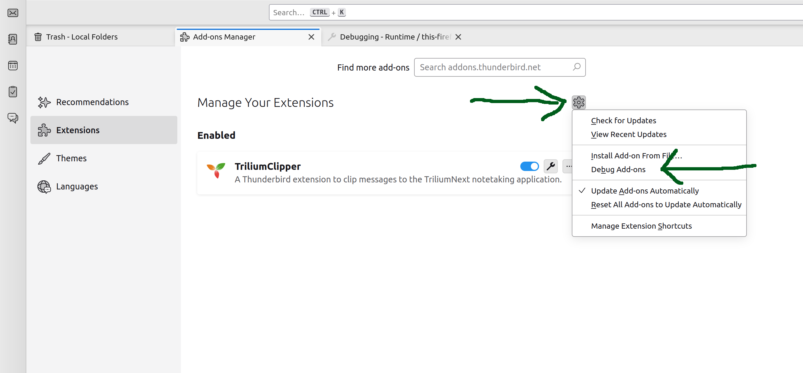

This project is a fork of [ThunderbirdObsidianClipper](https://github.com/KNHaw/ThunderbirdObsidianClipper). The code is experimental at this point in time and is being developed. As is, the extension will send e-mail to TriliumNext.

# ThunderbirdTriliumClipper User Guide
TriliumClipper is an add-on for the Thunderbird email client that lets a user clip messages to the TriliumNext notetaking application. You can find out more at the <!--[Thunderbird add-on page](https://addons.thunderbird.net/en-US/thunderbird/addon/obsidianclipper/) or [at the -->  [project GitHub page](https://github.com/0xbismarck/ThunderbirdTriliumClipper/).

## Table of Contents
- [Installation](#Installation)
- [Usage](#Usage)
- [Add-on Options](#Add-on-Options)
- [Placeholders](#Placeholders)
- [Colored Message Tags (Optional Feature)](#Colored-Message-Tags-Optional-Feature)
- [Troubleshooting](#Troubleshooting)
- [Questions? Feedback?](#Questions-Feedback)

## Installation
You will first need to have the TriliumNext notetaking app on your local platform as well as the Thunderbird email client.
  - You can download Thunderbird for free [here](https://www.thunderbird.net/en-US/download/).
  - You can download TriliumNext for free [here](https://github.com/TriliumNext/Notes/releases).

Currently working to get *Trilium Clipper* added into the Thunderbird Add-on Manager. Until then, you can install Trilium Clipper by downloading the installation file from the [TriliumClipper Add-on Site](https://github.com/0xbismarck/ThunderbirdTriliumClipper/releases/), downloading the XPI file, and install that file from the add-on manager (*Add-on Manager->Settings->Install Add-on From File*).
  <!--- You can install the *Trilium Clipper* add-on into Thunderbird in two ways:
    <!-- - By searching for "ObsdianClipper" in the Add-on mMnager (*Settings->Add-ons Manager*).
    - Or by downloading a file from the [Thunderbird Add-on Site](https://addons.thunderbird.net/en-US/thunderbird/addon/obsidianclipper/), clicking the "Download Now" button to get an XPI file, and installing that file from the add-on manager (*Add-on Manager->Settings->Install Add-on From File*). -->
To test the development version of Trilium Clipper downlaod the source code from the [TriliumClipper Site](https://github.com/0xbismarck/ThunderbirdTriliumClipper) and follow then follow the instructions [here](https://developer.thunderbird.net/add-ons/hello-world-add-on#installing).

After installing TriliumClipper to your Thunderbird client, select the Options tab (*Settings->Add-ons Manager->Trilium Clipper->Options tab*) and configure the add-on to work with TriliumNext on your machine.
<!--  
@todo - add this back in later-->

After you've installed and configured the add-on, you're ready to clip emails!

## Usage
To use TriliumClipper, just select an email and either right click it to find an "TriliumNext" icon in the menu or open the email and look for the "TriliumNext" icon on the header (where you will also find the Reply and Forward buttons). Press the "TriliumNext" button and the message will be sent to your TriliumNext application. (Note, TriliumNext needs to be open before you send an e-mail)

Once your email has been clipped, it will look like the screenshot below. By default, your note will be placed under the note with the ParentNoteId that was configured in the Options.

If you only wish to clip a portion of an email's text, select the text before pressing the TriliumNext icon.

## Add-on Options
There are a number of options that a user can use to configure the clipper add-on. These can be found on the Options tab for the add-on.

- *Trilium URL* - The Trilium URL is the location where TriliumNotes sends data for the creation of a new note. By default, when TriliumNext is installed on your local machine, it will receive the note on the localhost:port combination below. Otherwise you need to specifiy where Thunderbird needs to send data.
- *ETAPI Token* - TriliumNext uses an authentication token to confirm that Thunderbird has permission to create notes. To generate an ETAPI token, you need to open TriliumNext and click on the TriliumNext icon in the upper left corner. Then click 'Options' -> 'ETAPI' -> 'Create New ETAPI Token'. After the token is created, store it in this field.
- *ParentNoteId* - Thunderbird needs to know where in TriliumNext the software should send the new note. The noteId for any note can be found by clicking the "Note Info" icon (the 'i' within a circle) towards the top of the note. After clicking the icon, you will see the field called "Note ID". Enter that value below.

<!--- *Message Attachments (Optional Feature)* - To save email attachments with clipped emails, do the following:
    - Set the checkbox labeled "Enable saving of email attachments" and save the setting. Because the configuration steps
    below need to be run before attachments can be saved, ObsidianClipper requires this manual step and will not
    by default save attachments.
    - Choose a location inside your Obsidian vault where the attachment files should go and enter the path to it 
    in the "Attachment Save Folder" field. This should be relative to the Obsidian vault's root directory.
    For example, setting this parameter to 'business/important emails/_resources' would place
    your clipped emails into a '_resources' folder beneath 'business/important emails'
    inside your vault. This value is what sets the path to attachments in the _MSGATTACHMENTLIST template, below.
    If not properly set your clipped email will not point to the clipped attachments.
    - ObsidianClipper can't change the default location to save files like attachments, so 
    read the section "Attachment Permissions" carefully to set the path for saving files. -->
- *Note Filename and Content Templates* - These two fields allow a user to specify how notes clipped from emails are named and how 
  data is saved in Obsidian by use of placeholders in the text. See the Options tab of the add-on for a brief rundown of the
  different placeholder fields or the [Placeholders](#Placeholders) section of this guide for the definitive list of
  supported placeholders.

## Placeholders
Message specific information can be inserted into a note by putting "placeholders" into the *Filename Template* and *Note Content Template* fields in the options tab.
These placeholders and what is substituted in the clipped note are detailed below:
- *_NOTEDATE* - The current date. Fields from the note date are inserted with these other symbols:
    - *_NOTEYEAR* for a 4 digit year, *_NOTEMONTH* for a 01-12 month, or *_NOTEDAY* for a 00-31 day of the month.
- *_NOTETIME* - The current time. Fields from the note time are inserted with these symbols:
    - *_NOTEHOUR* for the 00-23 hour, *_NOTEMIN* for a 00-59 minute, or *_NOTESEC* for a 00-59 second.
- *_MSGDATE* - The message date. Fields from the message date are inserted with these other symbols:
    - *_MSGYEAR* for a 4 digit year, *_MSGMONTH* for a 01-12 month, or *_MSGDAY* for a 00-31 day of the month.
- *_MSGTIME* - The message time. Fields from the message time are inserted with these symbols:
    - *_MSGHOUR* for the 00-23 hour, *_MSGMIN* for a 00-59 minute, or *_MSGSEC* for a 00-59 second.
- *_MSGSUBJECT* - The message subject.
- *_MSGRECIPENTS* - List of all message recipients (in the email "to" field).
    - Similarly, *_MSGCC* will list the addresses from the "cc" field and *_MSGBCC* will list the addresses from "bcc"
- *_MSGAUTHOR* - The message author.
<!--- *_MSGATTACHMENTLIST* - A markdown list of links to message attachments saved to Obsidian. If no message attachments were saved, returns the string "none."-->
- *_MSGIDURI* - A URI that can be clicked to open the message.
    - For example, combining the text in the field 'Message Link Text' _MSGURI will create a link in your note that when clicked will open the email in your client.
- *_MSGCONTENT* - The actual text content of the message.
    

## Troubleshooting
If TriliumClipper is not working for you, please take a moment to reread the instructions and reinstall the add-on. You might also consider making sure both Thunderbird and TriumiumNext are both properly closed via the task manager. 

If that does not work, please try some of the steps below.

Before you use this extension to send e-mails to TriliumNotes, remember to have TriliumNotes open on your computer.

### TriliumNext Parent Note Does Exist.
If you clip an email and see a "TriliumNextClipper: Validation failed on property 'parentNoteId': Note 'XL1NKSAV3H1RUL3' does not exist." error, the *ParentNoteId* field is not set properly. If you are unsure of the value to set, scroll up to #Add-on-Options and review the instructions.

<!-- ### Unable to Save Email Attachments
The attachment clipping feature was added in ObsidianClipper version v4.1 in July of 2024. It is unclear what, if any
problems that users might encounter using this feature. If you have a problem, please 
[file an issue on GitHub](https://github.com/KNHaw/ThunderbirdObsidianClipper/issues) so the development team can assist you and 
update this User Guide to refelct the solutions that were found. -->

### Note Content Corrupted or Missing
If you do not see the expected content in a note that has been clipped, look at the *Note Content Template* field in the options menu
and make sure that the *_MSGCONTENT* placeholder is present. If is isn't, the body of your email will not be clipped.

If this happens, insert the *_MSGCONTENT* placeholder into the *Note Content Template* field and save it 
or use the "Restore Default" button to go back to a known, good baseline.

### TriliumNext Button Missing
There is a [known issue](https://github.com/0xbismarck/ThunderbirdTriliumClipper/issues/2) when [Thunderbird Conversations](https://addons.thunderbird.net/en-US/thunderbird/addon/gmail-conversation-view/) is installed and enabled. The issue is currently being investigated. For the moment there are two options for users that experiance this issue:
- Use the classic reader option
- Disable the Conversations add-on

If the button is missing and you don't have the add-on installed, try disabling any other add-on you have installed until the button reappears. Once you identify which add-on causes a conflict with TriliumNext, please submit a [bug report](https://github.com/0xbismarck/ThunderbirdTriliumClipper/issues) with information about what add-on is causing an issue, a link to the add-on page, your Thunderbird version, and what operating system you are using.

### Capturing a Debug Log
If you have tried the above and have not fixed your problem, you should capture a debug log and send it to the development team via the feedback links below.
Just be sure to remove any sensitive information such as email addresses before sending in debug data.

#### Capturing a Debug Log- Step 1
From the Settings menu, select "Add On manager." Then click on the gear tab there and select "Debug Add-ons"

#### Capturing a Debug Log - Step 2
From the Debug tab, scroll down to Trilium Clipper and click the "Inspect" button.

#### Capturing a Debug Log - Step 3
You will see the debug console launch in a new window. Back in Thunderbird, select an email and try to clip it 
(please pick a test email that does not have sensitive information). 
You should see some text appear on the console log (lower right corner). Right click on any of that text and select "Copy All Messages." 
This will put the log into the clipboard, which you can then put in the notepad application or place in an email back to the development team.

## Questions? Feedback?
TriliumClipper is still a work in progress. If you have any questions or want to give me feedback, please reach out to to the team
by [filing an issue on GitHub](https://github.com/0xbismarck/ThunderbirdTriliumClipper/issues).

If sending screenshots for a bug report or via email, make sure to blur or mark out any sensitive information since the images may be accessible to the wider internet.

I hope this add-on proves useful to you.
